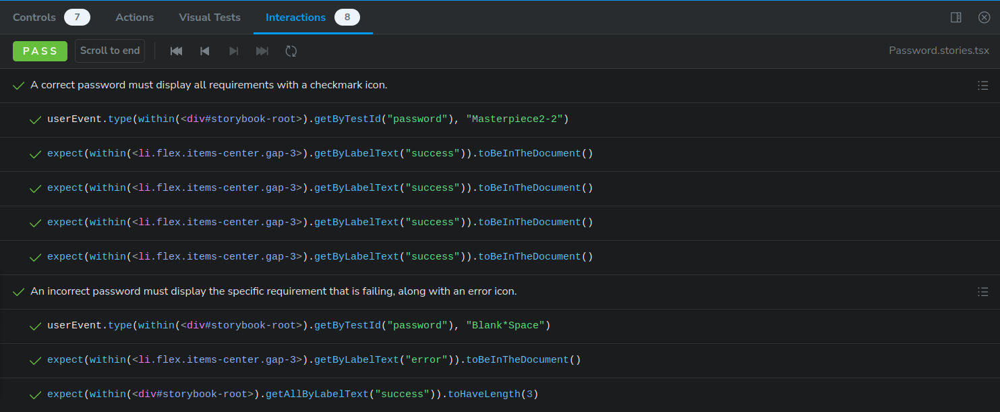

# Password Component

A customizable password component that allows you to pass a list of requirements, making it easy to enforce various password policies in your application.

## Table of Contents

- [Password Component](#password-component)
  - [Table of Contents](#table-of-contents)
  - [Installation](#installation)
  - [Running the Project](#running-the-project)
  - [Running Tests](#running-the-tests)
  - [Storybook Tests](#storybook-tests)
  - [Project Structure](#project-structure)

## Installation

```
git clone
cd password-component
npm install
```

## Running the project

We use storybook for component development for its ability to develop UI components in isolation, providing real-time feedback, documentation, and robust testing.

```
npm run dev
```

## Running the tests

The `validatePassword` function has tests to ensure its correct operation.

```
npm run test
```

## Storybook tests

The component can be tested on Storybook under the interactions tab (see image as reference)



## Project structure

```
password-component/
├── .storybook/ # Storybook configuration
├── src/ # Source files
│ ├── Password/ # Password component files
│ │ ├── index.tsx
│ │ ├── Password.stories.tsx
│ │ ├── utils/ # Utility functions for Password component
│ ├── App.tsx # Main app component
│ ├── Check.tsx # Check component
│ ├── Error.tsx # Error component
│ ├── index.css # Global CSS
│ ├── main.tsx # Entry point
```
